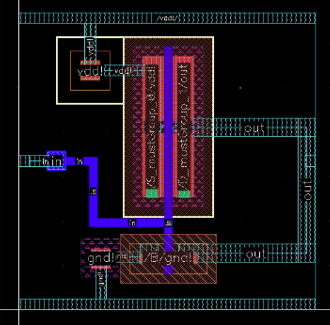

Design Flow
========

Choosing Transistor Variant
---------------------------

A Process Design Kit (PDK) includes a variety of transistors. These may have different supply and threshold voltages. These are usually `LVT`, `SVT`, `HVT`.
Some PDKs offer `ULVT` and `UHVT` versions too. Higher the threshold voltage, lesser is the leakage current in the transistor. If a system is not timing
critical, `HVT` transistors are suitable, whereas when speed is the primary concern, `LVT` cells are preferable. Multi-Vt algorithm is used during optimization
to reduce leakage power of the design while meeting the timing/delay requirement at same time. The HVT cells are used on less timing critical path to reduce
leakage power whereas `LVT` cells are used for more timing critical paths. This flow also takes care of Noise. This method not only reduces leakage power during
the standby mode, but also during active mode operation of the device.

Schematic Generation
--------------------

We follow the CMOS logic topology. All multiplications in the boolean expression represent transistors connected in series, and all additions represent parallel
connections. We use the `Cadence Virtuoso Schematic Editor` to instantiate transistors from a said PDK. Post connecting all nets in the schematic, we create pins
to interface the input, output, power and ground signals. These are packaged as a symbol to be used as a design under test (DUT). We use a testbench schematic
to drive inputs to the combinatorial/sequential standard cell. All cells assume a minimum fan-out of `20 fF` for their minimum drive strength variant.
We import this schematic to the `Cadence Analog Design Environment` to define transient and DC analyses. These analyses are then exported as a `spectre` netlist.
These netlists contain all aspect ratios and the supply voltage as free design parameters, hence enabling some level of automation.

Computing the Optimal Supply voltage
----------------------------------

We design the schematic for a basic CMOS inverter, sized for symmetric operation, and vary the supply voltage in order to maintain a static `logic high` for
computing leakage. Static energy `Estat` is measured as `Vleak/Rout` while performing a DC analysis, and Dynamic energy `Edyn` is measured as the integral of
total current at the output node for one complete transition (l-h-l). It can be observed that `Edyn` increases, and `Estat` with an increase in the supply voltage.
We compute the total energy `Etot` as `Estat + Edyn`. We plot Static, Dynamic, and Total energy against supply voltage to identify the supply voltage at which the minimum energy point is achieved. This value of
supply voltage is considered to be the optimal supply voltage for energy efficient operation.

Transistor Sizing
-----------------

We utilise the netlists exported in `Schematic Genaration` to perform a multi-variable multi-objective optimization. Transistor sizing is treated as a 
non-linear curve fitting problem. Genetic algorithms would be the most common approach, but we use the `Gauss-Newton method using a trust region approach`.
Given a set of `m` empirical pairs `(xi, yi)` of independent and dependant variables, find the parameters `B` of a model curve `f(x, B)` such that the sum
of the squares of the deviations is minimized. We use `Cadence SpectreMDL` to write scripts that can interface the `Spectre Circuit Simulator`.

We define 2 `measurement alias` within the MDL control file, and export the following variables for computation:

.. code:: RST

   fall = falltime(sig=V(OUT), initval=vdd, inittype='y, finalval=0.0, finaltype='y, theta1=90, theta2=10)
   rise = risetime(sig=V(OUT), initval=0.0, inittype='y, finalval=vdd, finaltype='y, theta1=10, theta2=90)
   tphl = cross(sig=V(OUT), dir='fall, n=1, thresh=vdd/2) - cross(sig=V(IN), dir='rise, n=1, thresh=vdd/2)
   tplh = cross(sig=V(OUT), dir='rise, n=1, thresh=vdd/2) - cross(sig=V(IN), dir='fall, n=1, thresh=vdd/2)
   delay = max(rise, fall) + max(tphl, tplh)
   energy = integ(I$INAME:pwr, from=starttime, to=stoptime)

All these parameters are normalized to lie between 0 and 1, and compute the tradeoff between energy and delay as described in [3].

We use the `mvarsearch` construct within `SpectreMDL` to perform the optimization.

.. code:: RST

   mvarsearch
    {

   option
    {
           options_statements
       }

   parameter
    {
           parameter_statements
       }

   exec
    {
           exec_statement -- run statement to compute goal values.
       }

   zero
    {
           zero_statements
       }
   }

The option_statements include:

.. code:: RST

   [ method = method ]
   [ accuracy = conv_tol ]
   [ deltax = diff_tol ]
   [ maxiter = maxiter ]
   [ restoreParam = restoreParam ]

The parameter_statements include:

`{param_name, init_val, lower_val, upper_val}`

In the following example design parameters para_pw and para_nw are varied by the optimization algorithm starting at an initial value of 1.2 microns
with a maximum value of 10 microns and a lower limit of 0.1 microns. At each iteration, the measurement alias trans is run after the design parameter
value is set. The zero values tmp1 and tmp2 are then computed using the results from the measurement alias. This iteration continues until one of the
following happens:

| -tmp1 and tmp2 satisfy the conv_tool criteria determined by the following equation: (tmp1*tmp1 + tmp2*tmp2) < 1.0e-03
| the maxiter parameter value is exceeded

.. code:: RST

   alias measurement trans {
   run tran( stop=1u, autostop='yes )
       export real rise=risetime(sig=V(d), initval=0, inittype='y, finalval=3.0, 
          finaltype='y, theta1=10, theta2=90) // measured from 10% to 90% 
       export real fall=falltime(sig=V(d), initval=3.0, inittype='y, finalval=0.0,
          finaltype='y, theta1=90, theta2=10) // measured from 10% to 90% 
   }
   mvarsearch {
       option {
          accuracy = 1e-3     // convergence tolerance of trans->rise
          deltax = 1e-3       // numerical difference % of design variables
          maxiter = 100       // limit to 100 iterations
       }
       parameter {
          {para_pw, 1.2u, 0.1u, 10u}
          {para_nw, 1.2u, 0.1u, 10u}
       }
       exec {
          run trans
       }
       zero {
          tmp1 = trans->rise - 3ns
          tmp2 = trans->fall - 3ns 
       }
   }

Layout Generation
-----------------

A standard cell design is said to be complete when it contains `Timing`, `Power`, and `Area` information ready for synthesis, PnR. We use the `Cadence
Virtuoso Layout Editor` to route layers.

We initially create all sources based on the schematic that has been sized and verified for functionality. We create all pins in the `ME1 PIN` layer, and
the lowest metal layer is `ME1`. We create a PnR boundary to accommodate all transistors and routings, and we place our pins. The `VDD` pin is snapped to the top 
and the `GND` pin to the bottom of our PnR boundary, and we create horizontal rails for both these pins. We snap all `input` pins to the left, and all output
pins to the right. Given below, is the layout for our inverter in 28nm CMOS.

Once the layout has been generated for a said standard cell, we perform a `Design Rule Check` and generate a `Layout vs Schematic` database

Layout Design Source specifies whether you want to check a Cadence Design Framework II cellview or a Stream (GDS) formatted file.
Click on the cyclic button to change this format.

Once `LVS` has passed without any errors, we can proceed further, and extract the post layout netlist for our standard cell.

Netlist Extraction
------------------

We pass the `cdl` to some physical extraction tools like `Assura` or `Calibre` to perform a parasitic extraction.

Interconnect capacitance is calculated by giving the extraction tool the following information: the top view layout of the design in the form of input
polygons on a set of layers; a mapping to a set of devices and pins (from a Layout Versus Schematic run), and a cross sectional understanding of these layers.
This information is used to create a set of layout wires that have added capacitors where the input polygons and cross sectional structure indicate.
The output netlist contains the same set of input nets as the input design netlist and adds parasitic capacitor devices between these nets.

Interconnect resistance is calculated by giving the extraction tool the following information: the top view layout of the design in the form of input
polygons on a set of layers; a mapping to a set of devices and pins (from a Layout Versus Schematic run), and a cross sectional understanding of these layers
including the resistivity of the layers. This information is used to create a set of layout sub.wires that have added resistance between various sub-parts of
the wires. The above Interconnect Capacitance is divided and shared amongst the sub-nodes in a proportional way. Note that unlike Interconnect Capacitance,
Interconnect Resistance needs to add sub-nodes between the circuit elements to place these parasitic resistors. This can greatly increase the size of the
extracted output netlist and can cause additional simulation problems.

We only extract the R & C components in our standard cells.
Post-layout `spice` netlists are obtained after parasitic extraction.

Cell Charecterization
---------------------

We use `Cadence Liberate` to perform cell characterization.
All netlists are directly imported from the physical extraction tool, and a template is defined in tcl.

We define some variables to be used for altos simulations as follows.

.. code:: RST
   
   set_var slew_lower_rise 0.2
   set_var slew_lower_fall 0.2
   set_var slew_upper_rise 0.8
   set_var slew_upper_fall 0.8
   set_var measure_slew_lower_rise 0.2
   set_var measure_slew_lower_fall 0.2
   set_var measure_slew_upper_rise 0.8
   set_var measure_slew_upper_fall 0.8
   set_var delay_inp_rise 0.5
   set_var delay_inp_fall 0.5
   set_var delay_out_rise 0.5
   set_var delay_out_fall 0.5

We define minimum and maximum transition, capacitance as follows.

.. code:: RST

   set_var min_transition 6e-12
   set_var max_transition 0.3e-9
   set_var min_output_cap 0.1e-15

We define all clocks and pins as follows.

.. code:: RST

   set inputs { A B C D E EN SE SI }
   set clocks { CK CKN G GN }
   set asyncs { RN SN }
   set outputs { Q QN Y }
   ...
   define_cell \
   -input $inputs \
   -clock $clocks \
   -async $asyncs \
   -output $outputs \
   $cells

We define the characterization script as follows.

Reading in the spice using the `read_spice` command prepares the Liberate to process the cell for Inside-View functional recognition and vector generation.
The tool processes the cell netlist read in during read_spice and automatically
identifies paths where pins and related pins statically interact (i.e. where they are connected). The
circuit is also analyzed for paths that are associated with input pin capacitance. These paths are
stored for later simulation. Pre-processing occurs during char_library and not during
read_spice to leverage parallel compute resources for maximum through-put.
Liberate performs an accurate characterization using a full spice solver (like Spectre® APS) is performed on all the arcs
for all slews and loads.

We use a file structure as follows for ease of characterization.

.. code:: RST

   |-- cells.tcl
   |-- models
   |-- netlist
   |-- tcl
   | |-- char.tcl
   | |-- settings.tcl
   |-- template

Liberate is a tcl-based interpreter extended with commands and settings to perform
characterization. On the command-line you call Liberate with a tcl script. The tee command will
capture the tool output to a file and also print to the screen

`csh> liberate char.tcl |& tee char.log`

You can call up Liberate without a script file as the parameter, and it will give you an interactive
tcl prompt. This mode is handy for a quick reference for the Liberate commands.

| `csh> liberate`
| `liberate > define_cell -help`

The following settings are used for liberate characterization.

We set the operating conditions as follows.

`set_operating_condition -voltage ${VDD_VALUE} -temp ${TEMP}`

We read the netlists and models as follows

.. warning::
   Characterization has to be performed at the same corner and temperature setting at which the parasitic elements are being extracted.
   simulator language has to be taken care of, while switching between spice and spectre file formats.

Once characterization of all the arcs are complete, the results are merged and a final Liberty (.lib)
file is written out.

Synthesis
---------

Once we have the timing library, we have to edit the `.lib` using a text editor and insert the area information. We compute cell area as the area occupied
by the PnR boundary in our cell layout.

The area information is inserted as follows.

.. code:: RST

   cell (INVX1) {
   area: 0.0; // insert area here
   ...
   }

We invoke `Cadence Genus` and perform a synthesis of some design.

.. code:: RST

   csh> genus -legacy_ui

.. note::
   The design to be synthesized is not fixed, and has to be written/generated by the user. This design could be the hardware description of anything
   from an inverter to an entire RISC-V.

Once we have invoked `Cadence Genus` and the license has been checked out, we perform the following operations, in this order.

.. code:: RST

   set_attribute lib_search_path /path/to/library/
   set_attribute library { LIBRARY_NAME.lib }
   read_hdl /path/to/hdl/
   ... // multiple verilog/vhdl files can be read here
   elaborate
   set_attriute retime true /designs/MODULE_NAME
   read_sdc /path/to/sdc/
   syn_gen
   syn_map
   syn_opt
   report_timing
   report_power
   report_area
   write_db -all_root_attributes DESIGN_NAME.db

.. note::
   This process is iterative. Slack has to be as close as possible to zero, on the positive side.

Upon successfully synthesizing the design, and mapping to our standard cell library, we should be able to export the synthesized netlist, for further processing.

Post-Synthesis Simulation
-------------------------

Once we have the synthesized netlist, we have to validate the synthesis by performing a gate level simulation, and verifying if the output is exactly the same as
that of the RTL.

We use `Cadence NCLaunch` to perform gate level simulations. Any verilog compiler should be able to do the same.
Verilog has to be generated for the standard cell library, using `Cadence Liberate`.

Verilog files have to compiled in this order:

#. Standard Cell Library (lib.v)
#. RTL Design (design.v)
#. Testbench (tb.v)

The end result of this post-synthesis simulation is a waveform dump (.vcd) which can be used with a power compiler to compute energy consumed per clock cycle.

.. autosummary::
   :toctree: generated

