Results
=======

Minimum Energy Point
--------------------

We compute the minimum energy point in terms of the supply voltage to be used, for various process technologies.
The following graph describes the trends in optimal supply voltage over different process nodes.

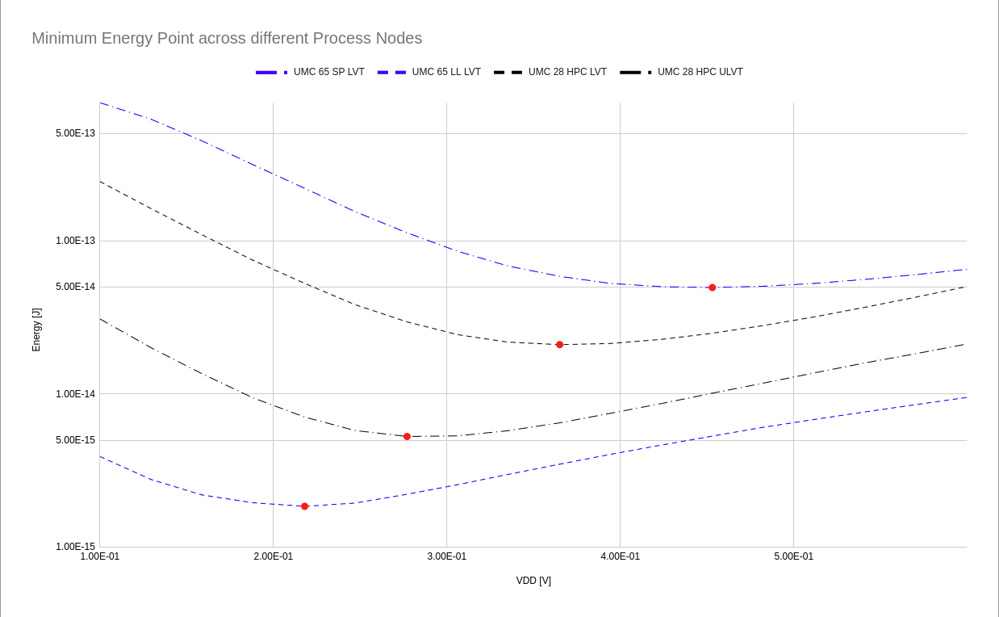

The following plots describe the variation in static and dynamic energy over a range of supply voltages.

.. image:: assets/umc65ll.png
   :align: center

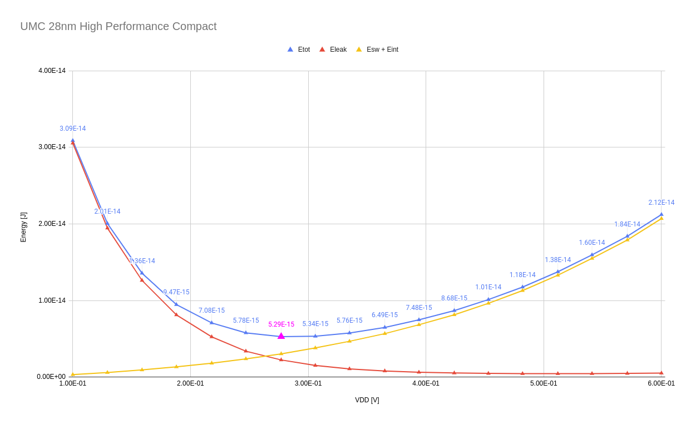

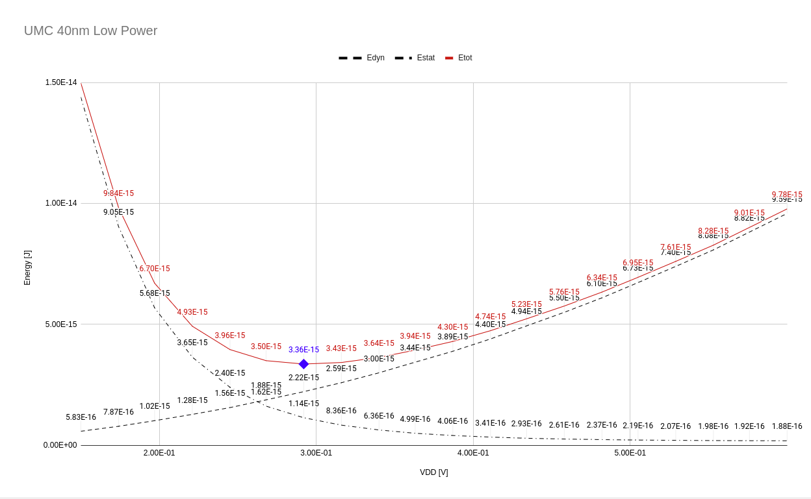

Power, Delay and Energy were plotted for a varying supply voltage.

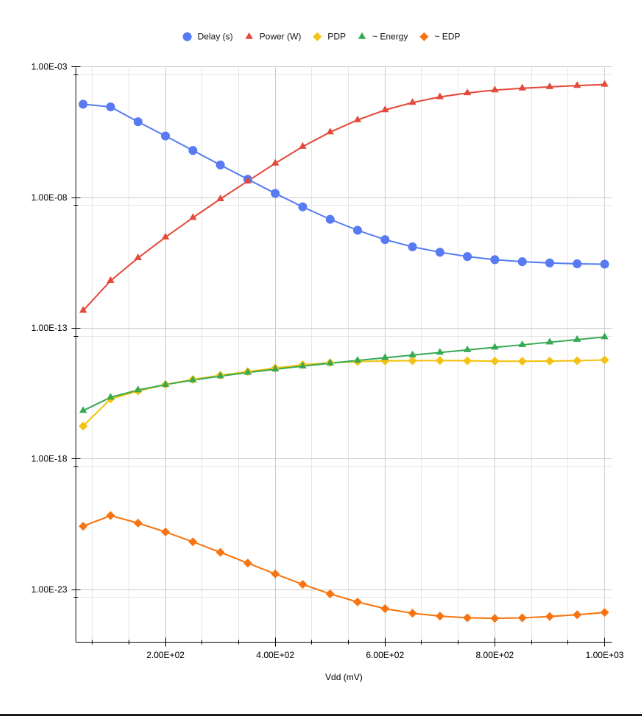

Cell Level Optimisation Results
-------------------------------

Cell level optimisation was done using `Cadence SpectreMDL`.
The following results are for an inverter in 40nm CMOS.
The solver used within SpectreMDL was `'lm`, and the inital point was a symmetric CMOS inverter with mininimum width n-mos.

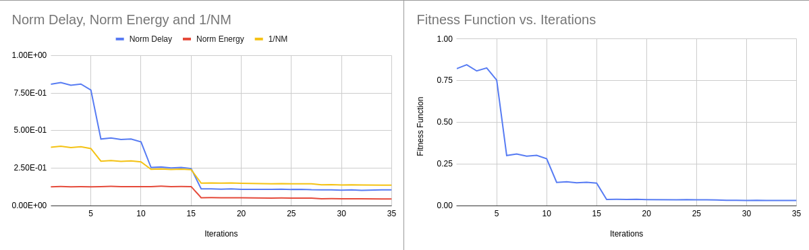

We try to further reduce the energy consumption of the inverter by increasing the weights in optimisation.

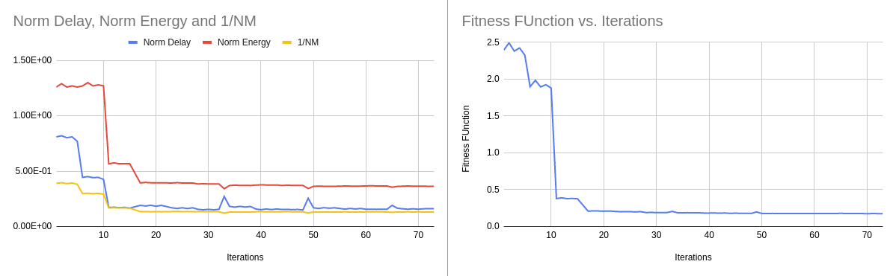

Upon plotting the entire set of solutions obtained during optimisation as intermediate results, we obtain the following scatter plot.
The red points are the 2 extreme solutions in terms of energy and delay.

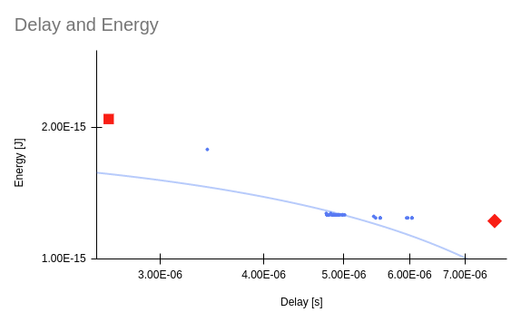

With PyMoo [4], we were able to plot the pareto front for UMC 28nm HPC. This plot is for an inverter.

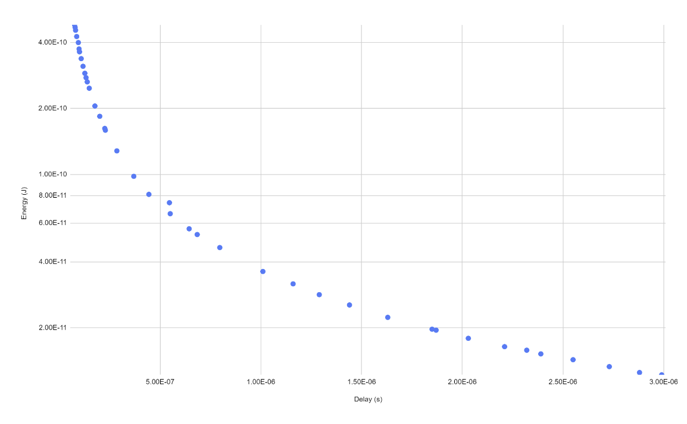

The intermediate results were plotted over generations for varying number of iterations.

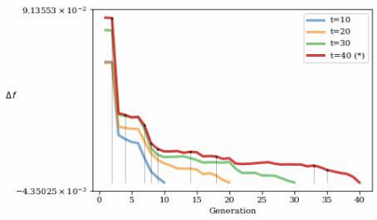

The weights can be further optimised to obtain results as per the standard cell and priority in objectives.
The objective function used was described in [3].

Synthesis Results
-----------------

Initially, a 32-bit ALU was synthesized with sub-vt standard cells in 180nm CMOS.
The following tabulation describes power and delay results in the same.

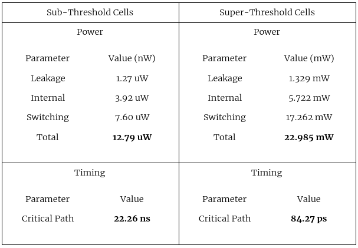

To understand the maximum operating speeds in sub-threshold, the largest possible cells (with 1 finger) were charecterized.
The following table describes the results obtained using these cells for a 32-bit ALU.

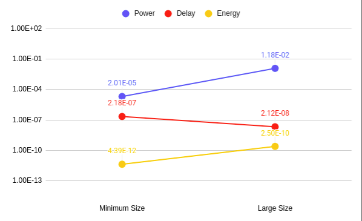

Chromite RV32IMFC was synthesized using UMC 28nm at 2 design goals (supply voltage), 180 mV and 300 mV _without_ any optimisation for sizing.
The following table describes the synthesis results for the same.

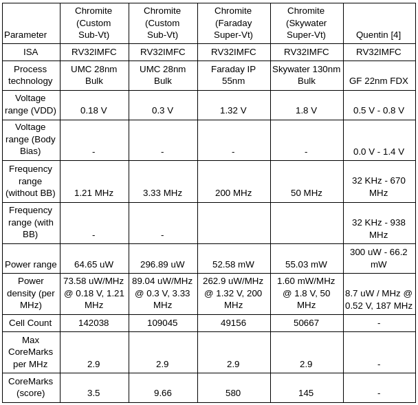

The following microarchitectural changes were made to the core:

#. mul_stages = (2, 4, 6)
#. isb_size (per stage) = 2,2,1,8,8 -> 4,4,1,16,16

Energy was plotted against execution time for benchmarks from Embench-IoT.

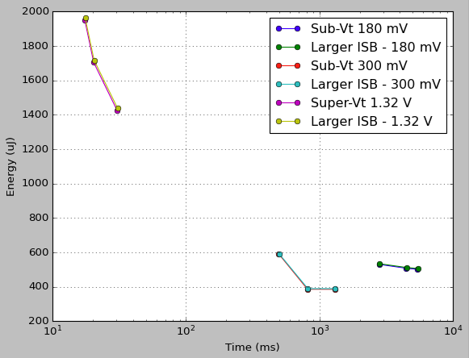

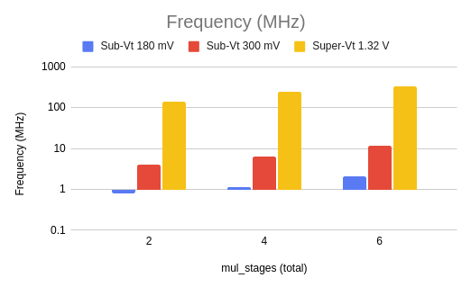

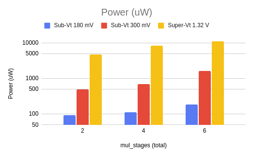

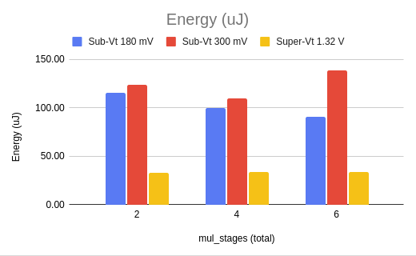

.. autosummary::
   :toctree: generated