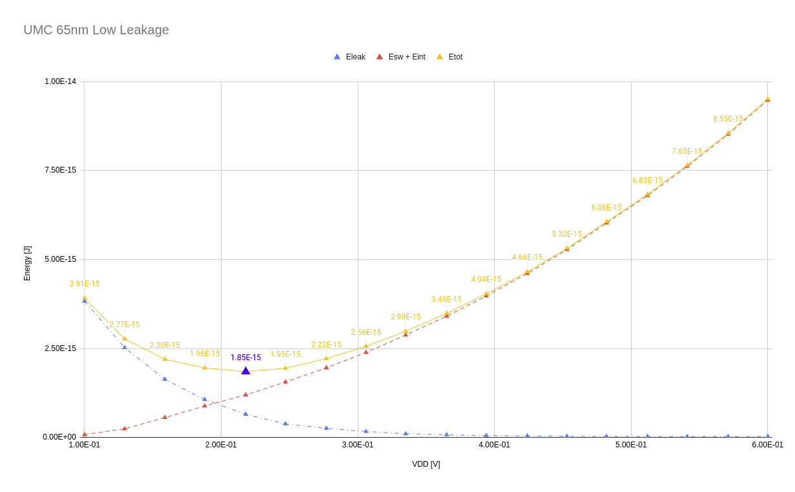

Results
=======

Minimum Energy Point
--------------------

We compute the minimum energy point in terms of the supply voltage to be used, for various process technologies.
The following graph describes the trends in optimal supply voltage over different process nodes.

UMC 180nm CMOS
--------------

Transistor sizing was done in the conventional method, matching push-up and pull-down currents. All pull-down paths with a single transistor had a minimum
sized nMOS.

Initially, a 32-bit ALU was synthesized with sub-vt standard cells in 180nm CMOS.
The following tabulation describes power and delay results in the same.

UMC 65nm CMOS
-------------

The minimum energy point was obtained for an inverter with sizing for symmetric operation.

An inverter was designed and it's sizing was optimized using `SpectreMDL`.

UMC 40nm CMOS
-------------

The minimum energy point was obtained for an inverter with sizing for symmetric operation.

An inverter was designed and it's sizing was optimized using `SpectreMDL`.

.. image:: assets/L40_INV.png
   :align: center

We try to further reduce the energy consumption of the inverter by increasing the weights in optimization.

After plotting the entire set of solutions obtained during optimization as intermediate results, we obtain the following scatter plot.
The red points are the 2 extreme solutions in terms of energy and delay.

.. image:: assets/scatter.png
   :align: center

Upon selecting the right weights for optimisation, and an initial point that is supportive of the solver's method, energy efficiency can be obtained.

UMC 28nm CMOS
-------------

The following plots describe the variation in static and dynamic energy over a range of supply voltages.

.. image:: assets/umc28hpc.png
   :align: center

Power, Delay and Energy were plotted for a varying supply voltage.

Chromite RV32IMFC was synthesized using UMC 28nm at 2 design goals (supply voltage), 180 mV and 300 mV _without_ any optimization for sizing.
The following table describes the synthesis results for the same.

.. image:: assets/chromite-28nm.png
   :align: center

The following microarchitectural changes were made to the core:

#. mul_stages = (2, 4, 6)
#. isb_size (per stage) = 2,2,1,8,8 -> 4,4,1,16,16

Energy was plotted against execution time for benchmarks from Embench-IoT.

Frequency, Power, and Energy were ploted for Chromite RISC-V.

.. image:: assets/color-power.png
   :align: center

.. image:: assets/color-energy.png
   :align: center

To understand the maximum operating speeds in sub-threshold, the largest possible cells (with 1 finger) were characterized.
The following table describes the results obtained using these cells for a 32-bit ALU.

.. warning::
   I have not synthesized any designs in 28nm CMOS post the transistor sizing, as optimization itself is still a work in progress. 

Standard cell sizing has to be optimized such that the energy consumption is below that of super-threshold synthesis.

.. autosummary::
   :toctree: generated