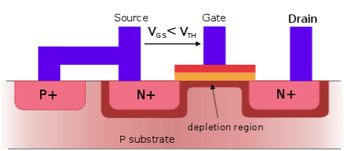
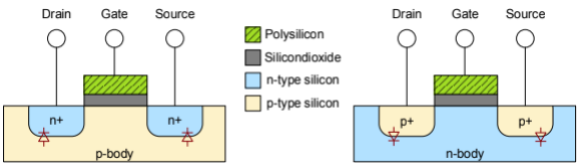
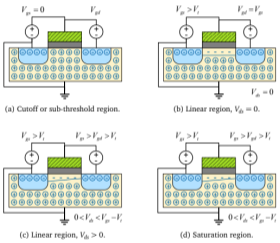
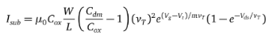

Theory
======

Structure of a MOSFET
---------------------

The Metal Oxide Semiconductor Field Effect Transistor is a type of insulated-gate field-effect transistor that is fabricated by the controlled oxidation
of a semiconductor, typically silicon. A MOSFET can be described as a voltage-controlled current source in electrical terms, here it operates as a switch
to conduct electricity in charging and discharging circuits. The below image describes the cross-section of an n-type MOSFET [1].

The voltage of the covered gate determines the electrical conductivity of the device; this ability to change conductivity with the amount of applied voltage
is used for switching electronic signals. The base material for MOSFETs is the semiconductor silicon (Si) which is a member of Group IV in the periodic table
of elements. With its four valence electrons, Si can form strong covalent Si-Si bonds with four surrounding Si atoms, leading to the formation of a
3-dimensional monocrystal structure. Si, as a substrate or wafer, has a lot of advantages due to the small mass, good thermal conductivity, the low cost,
and is widely used in microchip production because of these features. The conductivity of a pure Si crystal is very low since all of the four valence electrons
are required to form the bonds. To improve the conductivity of the Si crystal impurities, called dopants, are introduced into the crystal structure which
replaces Si atoms inside the crystal grid.

After the formation of four covalent bonds with the surrounding Si atoms, dopants from Group V of the periodic table of elements (e.g. Phosphorus, Arsenic)
have one excess electron left that can act as a free charge carrier inside the grid. Since this results in a net negative charge, it is called an n-type
semiconductor. If the silicon is doped with elements from Group III (e.g. Boron), i.e. with only three valence electrons, the dopant borrows an electron from
one of its neighbors creating a positively charged hole. This hole can propagate through the crystal, similar to free electrons, leading also to conductivity.
This is called a p-type semiconductor.

The operating principle of a transistor, e.g. MOSFET, is based on the diode effect of a semiconductor. Depending on the types of dopants used, different kinds
of MOSFETs with varying functionality can be built. The below image describes the cross-section of an n-type and p-ype MOSFET [2].

For the nFET, the body is p-type silicon with two areas of n-type silicon called source and drain. The source is generally connected to the ground (GND).
The gate stack, which consists of an insulating layer of SiO2 and the conducting gate terminal made of polysilicon, is placed between the source and drain.
Besides source, drain, and gate the fourth terminal connects the p-type body to a low potential, usually GND. Hence, the p-n junctions from the body to source
and drain remain reverse-biased.

The transistor functions as an on/off switch whose state is controlled by the gate. If no voltage is applied to the gate (a logical 0 in an IC) no electric
field is created between the body and the gate. Hence, the p-n junctions remain reverse-biased so that no current flows between source and drain and the
transistor is off. Increasing the gate voltage Vgs creates an electric field from the gate to the body that attracts electrons to the gate. When Vgs exceeds
the threshold voltage Vt, enough electrons are gathered beneath the gate to form a conducting channel. Current can flow from drain to source, turning the
transistor on.

For the pMOS transistor, the source and drain are made from p-type silicon while the body is n-type silicon. The pMOS body is held at a high potential,
usually, the supply voltage Vdd, to avoid forward-biasing the p-n junctions between source/drain and body as well as the p-n junction between the bodies
of nFET and pFET in proximity. The source is usually connected to Vdd.

As long as the gate is also at Vdd, the diodes between body and source and drain stop any current flowing from the source and drain. The transistor is in the
off state. When the gate voltage is lowered an electric field between the body (at Vdd) and gate forms. If Vgs is lowered enough, by the threshold Vt, the
field becomes so strong that it attracts enough holes to the area beneath the gate and a conducting channel forms. Electric charge can flow from source to
drain and the transistor is turned on.

Regions of Operation
--------------------

The threshold voltage Vt is not a constant but instead related to dynamic factors, like the source-body voltage Vsb of the transistor. The latter dependency
can be explained by the increasing amount of charge required to invert the channel if a body potential is applied. This phenomenon is also termed the body
effect.

The drain-source voltage Vds also affects Vt in the form of the drain-induced barrier lowering (DIBL) due to the electric field that is created between
source and drain. Turning a transistor on or off requires charging or discharging the gate where the amount of charge contributes to the power consumption
of the transistor and also influences the time it takes to charge or discharge the gate. In consequence, it is important to consider the capacitance of a
transistor in more detail. The image below describes the regions of operation in a MOSFET [2].

The terminals of a MOSFET are capable of storing electric charge and thus act as a capacitor when a potential difference between two terminals occurs.
The most obvious is the gate capacitor Cg that can be modeled as a simple plate capacitor with plate size W · L where W is the width and L is the length of
the gate. While the gate capacitor is required for the function of the transistor the other capacitors are not. Yet, their capacitance influences the
performance of the transistor. As a consequence, they are called parasitic capacitors. Another aspect of energy consumption is the unwanted current in a
transistor, called leakage. In a transistor below the threshold voltage, a small amount of charge flows between the source and drain. It is caused by the
thermal emission of carriers. In this state, which is also called weak inversion, the drain current is described by the following equation.

Hence, a linear dependency between channel length L and width W is observed. Another source of the leakage is the gate leakage Igate caused by electrons
tunneling through the gate oxide layer. This is related to the type and thickness of the oxide layer, but also linearly dependent on the gate width W.
The final leakage type is called junction-leakage Ijunc. It happens at the p-n junctions between drain/source and the body as even reverse-biased diodes
still conduct small amounts of current. Most of the leakage happens where the dopant is strongest, i.e. at the junction towards the gate.

CMOS Logic Gates
----------------

For logic gate design, a transistor can be regarded as a switch. If the switch is on a conducting connection between its source and drain is established.
The on and off states of the switch are controlled by its gate input. pFETs are low active, being on when the gate has a low input signal (logical 0).
nFETs transistors behave the opposite way, being on when the gate is high (logical 1). These simple switches allow the creation of more complex logic gates.

CMOS logic gates are made from a combination of pMOS and nMOS transistors. The transistors are placed complementary in the circuit. This ensures that either
the nFET or the pFET is turned off while its counterpart is active. The pFETs form the pull-up network while the nFETs form the pull-down network. Further
logic gates can be created by combining pull-up and pull-down networks of
parallel or series of transistors.

To transition from the logic design to a physical layout, a set of masks has to be created using a layout program. These masks specify the size and position
of the different transistor parts, e.g. n-well, poly-silicon, n- and p-type diffusion zones, metal, and contact layers. The designer has to follow design
rules specified by the manufacturer that depend on the production process. They constrain for example the sizes of and distances between specific parts.
Generally, smaller scales require more complex design rules making it difficult to adapt a layout to a new manufacturing process.

.. autosummary::
   :toctree: generated
